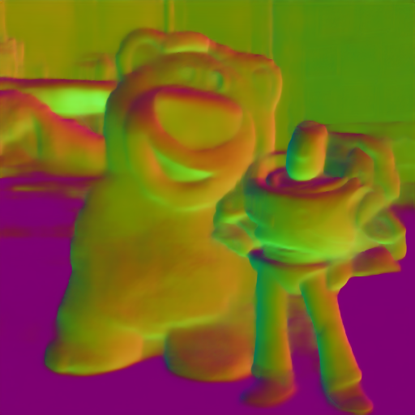
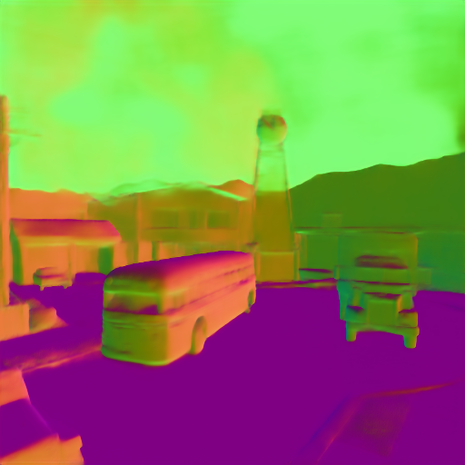
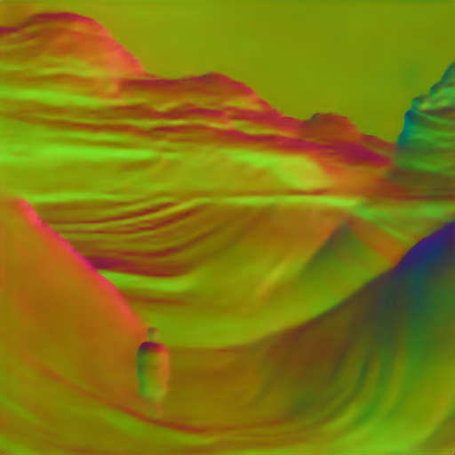
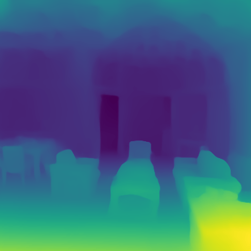
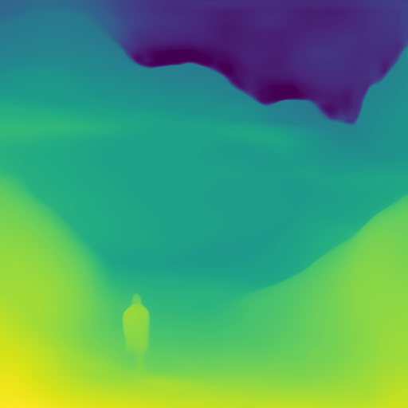
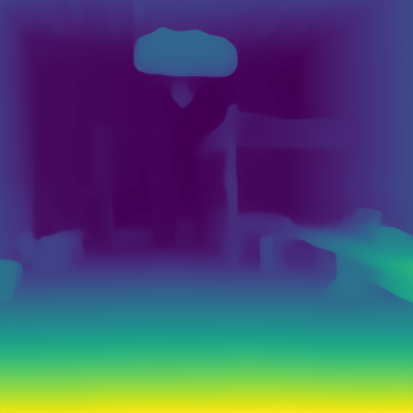

<div align="center">

# Omnidata (Steerable Datasets)
**A Scalable Pipeline for Making Multi-Task Mid-Level Vision Datasets from 3D Scans (ICCV 2021)**

  
[`Project Website`](https://omnidata.vision) &centerdot; [`Paper`](https://arxiv.org/abs/2110.04994) &centerdot; [**`>> [Github] <<`**](https://github.com/EPFL-VILAB/omnidata-tools/tree/main/omnidata_tools/torch) &centerdot; [`Docs`](//docs.omnidata.vision) &centerdot; [`Annotator`](https://github.com/EPFL-VILAB/omnidata-tools/tree/main/omnidata_annotator#readme) &centerdot; [`Starter Data`](//docs.omnidata.vision/starter_dataset.html) &centerdot;  

</div>

---

Table of Contents
=================

- [Pretrained models](https://github.com/EPFL-VILAB/omnidata/tree/main/omnidata_tools/torch#readme)
- [Dataset](https://github.com/EPFL-VILAB/omnidata/tree/main/omnidata_tools/torch), [dataloaders](https://github.com/EPFL-VILAB/omnidata/tree/main/omnidata_tools/torch)
- [Training code](https://github.com/EPFL-VILAB/omnidata/tree/main/omnidata_tools/torch) ([#MiDaS loss](https://github.com/EPFL-VILAB/omnidata/tree/main/omnidata_tools/torch#midas-implementation))
- [Generating 2D data from 3D data](https://github.com/EPFL-VILAB/omnidata/tree/main/omnidata_annotator#quickstart-run-demo)
- [Citing](https://github.com/EPFL-VILAB/omnidata/blob/main/README.md#citing)

---


### Pretrained models
[download script and code](https://github.com/EPFL-VILAB/omnidata/tree/main/omnidata_tools/torch#pretrained-models):
```bash
python demo.py --task depth --img_path $PATH_TO_IMAGE_OR_FOLDER --output_path $PATH_TO_SAVE_OUTPUT    # or TASK=normal
```
|  |   |   |   |  |  |  |
| :-------------:|:-------------:|:-------------:|:-------------:|:-------------:|:-------------:|:-------------:|
|  |  | |  |  | | |
|  |  | |  |  |  |  |
|  |  |  |  |  |  | 


## Dataset
How to download different subsets [here](https://docs.omnidata.vision/starter_dataset_download.html).
```bash
conda install -c conda-forge aria2
pip install 'omnidata-tools'

omnitools.download point_info rgb depth_euclidean mask_valid fragments \
    --components replica taskonomy \
    --subset debug \
    --dest ./omnidata_starter_dataset/ \
    --name YOUR_NAME --email YOUR_EMAIL --agree_all
```


## Generating 2D data from 3D data
You can use the CLI [here](https://github.com/EPFL-VILAB/omnidata/tree/main/omnidata_annotator#readme)
```bash
git clone https://github.com/Ainaz99/omnidata-annotator # Generation scripts
docker pull ainaz99/omnidata-annotator:latest           # Includes Blender, Meshlab, other libs
docker run -ti --rm -v PATH_TO_ANNOTATOR:/annotator -v PATH_TO_3D_MODEL:/model ainaz99/omnidata-annotator:latest
```


<br>

## Training code
- The folder [omnidata_tools/](omnidata_tools/) contains Pytorch dataloaders, download tools, code to run the pretrained models, etc). 
- The [paper_code/](paper_code/) contains a code dump for reference.
```bash
git clone https://github.com/EPFL-VILAB/omnidata
cd omnidata_tools/torch # PyTorch code for configurable Omnidata dataloaders, scripts for training, demo of trained models
cd omnidata_tools       # Code for downloader utility above, what's installed by: `pip install 'omnidata-tools'`
cd omnidata_annotator   # Annotator code. Docker CLI above
cd paper_code           # Reference

```

<br>


<br>

## Citing
```
@inproceedings{eftekhar2021omnidata,
  title={Omnidata: A Scalable Pipeline for Making Multi-Task Mid-Level Vision Datasets From 3D Scans},
  author={Eftekhar, Ainaz and Sax, Alexander and Malik, Jitendra and Zamir, Amir},
  booktitle={Proceedings of the IEEE/CVF International Conference on Computer Vision},
  pages={10786--10796},
  year={2021}
}
```
In case you use our latest pretrained models please also cite the following paper:
```
@inproceedings{kar20223d,
  title={3D Common Corruptions and Data Augmentation},
  author={Kar, O{\u{g}}uzhan Fatih and Yeo, Teresa and Atanov, Andrei and Zamir, Amir},
  booktitle={Proceedings of the IEEE/CVF Conference on Computer Vision and Pattern Recognition},
  pages={18963--18974},
  year={2022}
}
```
<!--  -->
> ...were you looking for the [research paper](//omnidata.vision/#paper) or [project website](//omnidata.vision)? 
