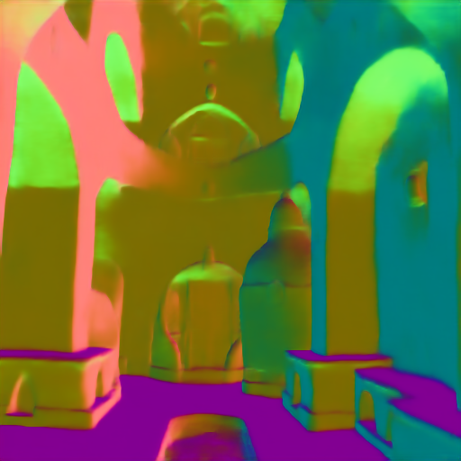
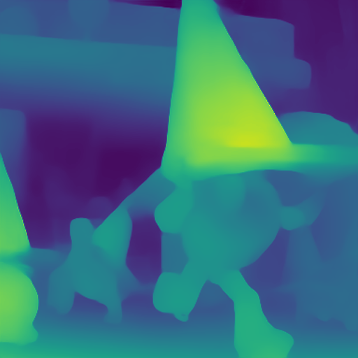
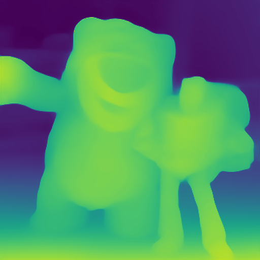
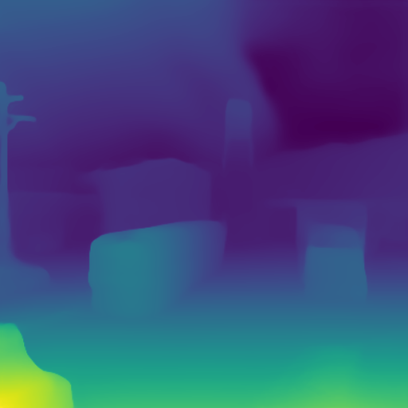
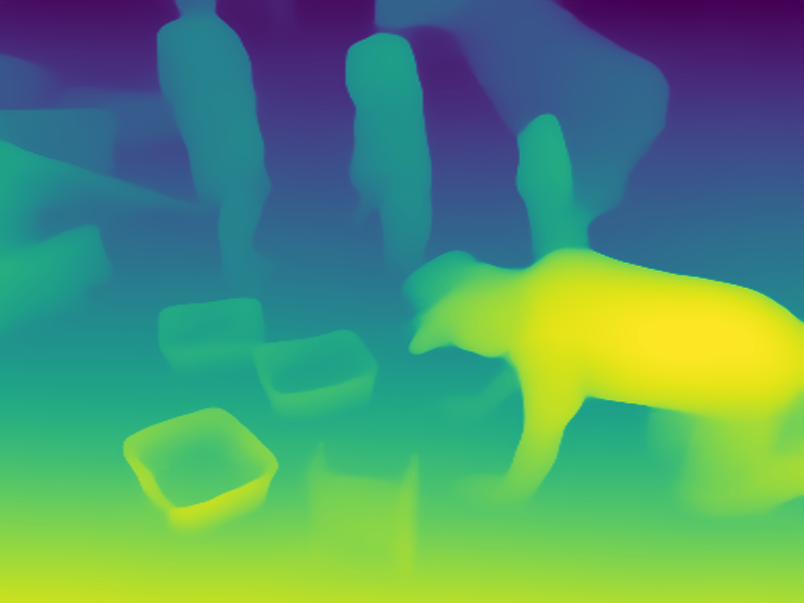
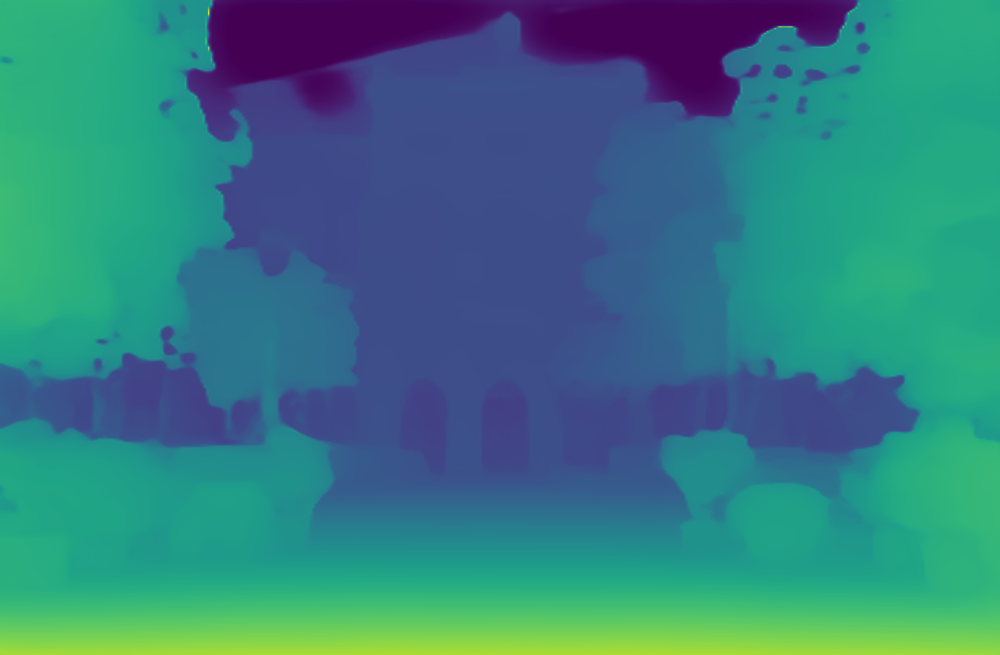
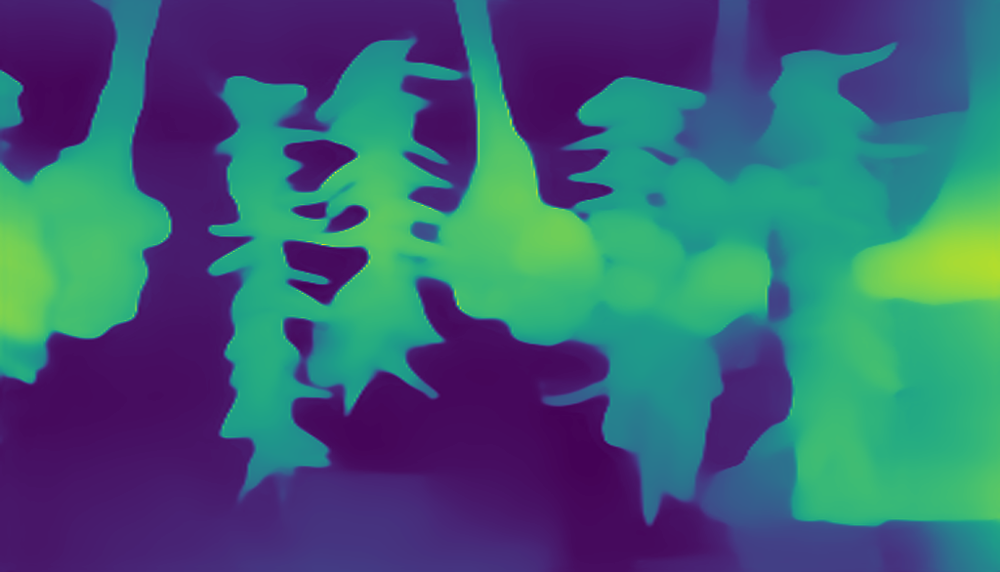
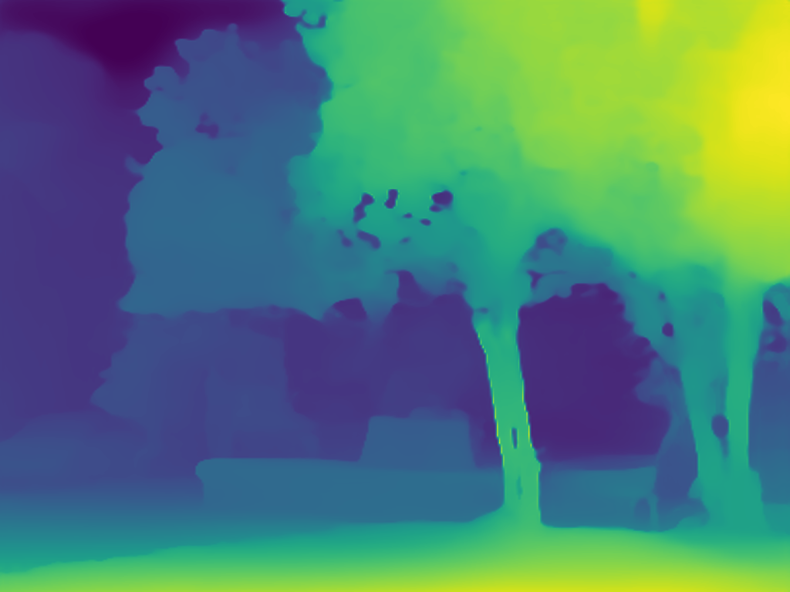

<div align="center">

# Omni ↦ Data (Under Construction)
**A Scalable Pipeline for Making Multi-Task Mid-Level Vision Datasets from 3D Scans**

  
[`Annotator Repo`](https://github.com/Ainaz99/omnidata-annotator) &centerdot; [`Starter Data`](https://github.com/EPFL-VILAB/omnidata-dataset) &centerdot;  [**`>> [Tooling+Training Repo] <<`**](https://github.com/Ainaz99/omnidata-tools) &centerdot;  [`Reference Code`](https://github.com/Ainaz99/Omnidata) &centerdot; [`Project Website`](https://omnidata.vision)

</div>

---

Omnidata Tools
=================

The repository contains some tools and code from our paper:
**Omnidata: A Scalable Pipeline for Making Multi-Task Mid-Level Vision Datasets from 3D Scans** (ICCV2021)
It specifically contains utilities such as dataloader to efficiently load the generated data from the Omnidata annotator, pretrained models and code to train state-of-the-art models for tasks such as depth and surface normal estimation, including a first publicly available implementation for MiDaS training code. It also contains an implementation of the 3D image refocusing augmentation introduced in the paper.


Table of Contents
=================

   * [Installation](#installation)
   * [Pretrained models for depth and surface normal estimation](#pretrained-models)
   * [Run our pretrained models](#run-our-models-on-your-own-image)
   * [MiDaS loss and training code implementation](#midas-implementation)
   * [3D Image refocusing augmentation](#3d-image-refocusing)
   * [Train state-of-the-art models on Omnidata](#training-state-of-the-art-models)
     * [Depth Estimation](#depth-estimation)
     * [Surface Normal Estimation](#surface-normal-estimation)
   * [Citing](#citation)


## Installation
You can see the complete list of required packages in [requirements.txt](https://github.com/Ainaz99/omnidata-tools/blob/main/requirements.txt). We recommend using virtualenv for the installation.

```bash
conda create -n testenv -y python=3.8
source activate testenv
pip install -r requirements.txt
```

## Pretrained Models
We are providing our pretrained models which have state-of-the-art performance in depth and surface normal estimation.
#### Network Architecture
The surface normal network is based on the [UNet](https://arxiv.org/pdf/1505.04597.pdf) architecture (6 down/6 up). It is trained with both angular and L1 loss and input resolutions between 256 and 512.

The depth networks have DPT-based architectures (similar to [MiDaS v3.0](https://github.com/isl-org/MiDaS)) and are trained with scale- and shift-invariant loss and scale-invariant gradient matching term introduced in [MiDaS](https://arxiv.org/pdf/1907.01341v3.pdf), and also [virtual normal loss](https://openaccess.thecvf.com/content_ICCV_2019/papers/Yin_Enforcing_Geometric_Constraints_of_Virtual_Normal_for_Depth_Prediction_ICCV_2019_paper.pdf). You can see a public implementation of the MiDaS loss [here](#midas-implementation). We provide 2 pretrained depth models for both DPT-hybrid and DPT-large architectures with input resolution 384.
#### Download pretrained models
```bash
sh ./tools/download_depth_models.sh
sh ./tools/download_surface_normal_models.sh
```
These will download the pretrained models for `depth` and `normals` to a folder called `./pretrained_models`.

## Run our models on your own image
After downloading the [pretrained models](#pretrained-models), you can run them on your own image with the following command:
```bash
python demo.py --task $TASK --img_path $PATH_TO_IMAGE_OR_FOLDER --output_path $PATH_TO_SAVE_OUTPUT
```
The `--task` flag should be either `normal` or `depth`. To run the script for a `normal` target on an [example image](./assets/demo/test1.png):
```bash
python demo.py --task normal --img_path assets/demo/test1.png --output_path assets/
```
|  |   |   |   |  |  |  |
| :-------------:|:-------------:|:-------------:|:-------------:|:-------------:|:-------------:|:-------------:|
|  |  | |  |  | | |
|  |  | |  |  |  |  |
|  |  |  |  |  |  | 


## MiDaS Implementation
We provide an implementation of the MiDaS Loss, specifically the `ssimae (scale- and shift invariant MAE) loss` and the `scale-invariant gradient matching term` in `losses/midas_loss.py`. MiDaS loss is useful for training depth estimation models on mixed datasets with different depth ranges and scales, similar to our dataset. An example usage is shown below:
```bash
from losses.midas_loss import MidasLoss
midas_loss = MidasLoss(alpha=0.1)
midas_loss, ssi_mae_loss, reg_loss = midas_loss(depth_prediction, depth_gt, mask)
```
`alpha` specifies the weight of the `gradient matching term` in the total loss, and `mask` indicates the valid pixels of the image.
|  |   |   |   |  |  |  |
| :-------------:|:-------------:|:-------------:|:-------------:|:-------------:|:-------------:|:-------------:|
|  |  | |  |  |  |  |
|  |  | |  |  |  |  
## 3D Image Refocusing
Mid-level cues can be used for data augmentations in addition to training targets. The availability of full scene geometry in our dataset makes the possibility of doing Image Refocusing as a 3D data augmentation. You can find an implementation of this augmentation in `data/refocus_augmentation.py`. You can run this augmentation on some sample images from our dataset with the following command. 
```bash
python demo_refocus.py --input_path assets/demo_refocus/ --output_path assets/demo_refocus
```
This will refocus RGB images by blurring them according to `depth_euclidean` for each image. You can specify some parameters of the augmentation with the following tags: `--num_quantiles` (number of qualtiles to use in blur stack), `--min_aperture` (smallest aperture to use), `--max_aperture` (largest aperture to use). Aperture size is selected log-uniformly in the range between min and max aperture. 


| Shallow Focus | Mid Focus | Far Focus |
| :-------------:|:-------------:|:-------------:|
|  |  |

## Training State-of-the-Art Models:
Omnidata is a means to train state-of-the-art models in different vision tasks. Here, we provide the code for training our depth and surface normal estimation models. You can train the models with the following commands:

#### Depth Estimation
We train DPT-based models on Omnidata using 3 different losses: `scale- and shift-invariant loss` and `scale-invariant gradient matching term` introduced in [MiDaS](https://arxiv.org/pdf/1907.01341v3.pdf), and also `virtual normal loss` introduced [here](https://openaccess.thecvf.com/content_ICCV_2019/papers/Yin_Enforcing_Geometric_Constraints_of_Virtual_Normal_for_Depth_Prediction_ICCV_2019_paper.pdf).
```bash
python train_depth.py --config_file config/depth.yml --experiment_name rgb2depth --val_check_interval 3000 --limit_val_batches 100 --max_epochs 10
```
#### Surface Normal Estimation
We train a [UNet](https://arxiv.org/pdf/1505.04597.pdf) architecture (6 down/6 up) for surface normal estimation using `L1 Loss` and `Cosine Angular Loss`.
```bash
python train_normal.py --config_file config/normal.yml --experiment_name rgb2normal --val_check_interval 3000 --limit_val_batches 100 --max_epochs 10
```
## Citation
If you find the code or models useful, please cite our paper:
```
@inproceedings{eftekhar2021omnidata,
  title={Omnidata: A Scalable Pipeline for Making Multi-Task Mid-Level Vision Datasets From 3D Scans},
  author={Eftekhar, Ainaz and Sax, Alexander and Malik, Jitendra and Zamir, Amir},
  booktitle={Proceedings of the IEEE/CVF International Conference on Computer Vision},
  pages={10786--10796},
  year={2021}
}
```
